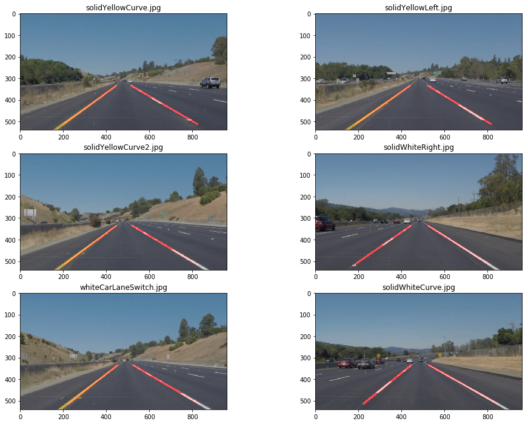

# **Finding Lane Lines on the Road** 

## Pipeline Desription
The pipeline includes 5 steps:
1. Color selection
2. Edge detection (including Gaussian blur)
3. Region selection
4. Hough transform to identify lines
5. Extrapolate the lines based on the calculate slopes and intercepts of lines

### Color Selection

#### Grayscale Color Selection
I compare the default gray scale color selection with [HSL](https://en.wikipedia.org/wiki/HSL_and_HSV) selection.
This is the result after applying the grayscale selection on the original image:


#### HSL Color Selection
And the result after apply the HSL color selection. I select the white and yellow color respectively.


Comparing to the grayscale, the HSL color selection helps seperate the traffic lines from the other elements in the images. 

### Edge Detection and Region Selection
Next, I use the [Canny edge detection algorithm](https://en.wikipedia.org/wiki/Canny_edge_detector). This algorithm applies the gaussian smoothing and detect the edges based on the intensity gradients on the images. The low and high threshold are 80 and 160 resepectively.

Since all the images are taken from a fixed angle camera, we can add a polygon with `cv2.fillPoly` to only consider the pixels in the region.

The left is the result after applying the edge detection. And the right is the result after applying both the edge detection and region of interest.


### Hough Transform
I use Hough Transform to detect line segments based on the result after applying the edge detection and region of interest. 

### Average and Extrapolation of Lines
However, the result can include multiple line segments for lanes. Since the slopes for left lines are negative and slopes for right lines are positive, I average over the slopes and intercepts separately on the left and right lines. This produces a single line for both left and right lane for the `draw_lines` function.
```python
def get_slopes_intercepts(lines):
    left = []
    right = []
    for line in lines:
        for x1, y1, x2, y2 in line:
            if x1 == x2:
                continue
            slope = (y2-y1)/(x2-x1)
            intercept = y1 - slope*x1
            length = np.sqrt((x2-x1)**2+(y2-y1)**2)
            if slope < 0:
                left.append(np.array([slope, intercept, length]))
            elif slope > 0:
                right.append(np.array([slope, intercept, length]))
    left = np.vstack(left) if len(left)>0 else None
    right = np.vstack(right) if len(right)>0 else None
    return left, right
```

Then based on the slopes and intercepts, I extrapolate the lane lines based on the region vertices.
```python
def extrapolate_lines(slopes_intercepts, vertices):
    # points in vertices are in anti-clockwise from left bottom
    p1, p2, p3, p4 = vertices[0]
    left_slope, left_intercept, right_slope, right_intercept = slopes_intercepts
    try:
        extra_p1 = (int((p1[1] - left_intercept)/left_slope), p1[1])
        extra_p2 = (int((p2[1] - left_intercept)/left_slope), p2[1])
        extra_p3 = (int((p3[1] - right_intercept)/right_slope), p3[1])
        extra_p4 = (int((p4[1] - right_intercept)/right_slope), p4[1])
    except ValueError as e:
        return np.array([None, None])
    except TypeError as e:
        return np.array([None, None])

    return np.array([[list(extra_p1 + extra_p2)], [list(extra_p3 + extra_p4)]])
```

These are the results after appying the line detection and extrapolation:



## Reflection

There are some issues in the current pipeline.

One potential issue is many parts of the pipeline are simply hardcoded and only applicable to this specific task. For example in the color selection, the selection ranges for white and yellow are tuned by trial and error. To make it more robust, we can apply some machine learning models to self-select the ranges. And although the region of interest helps to improve the line detection in this task, this hard-coded polygon may not work when we analyze on the images taken from differnt camera angles.

Another potential issue is the extrapolation method can be improved. From the video tests we can see that the straight line is not fitting well sometimes on curved lane lines. We can try [spline interploation](https://en.wikipedia.org/wiki/Spline_interpolation) to improve the line fitting. 

